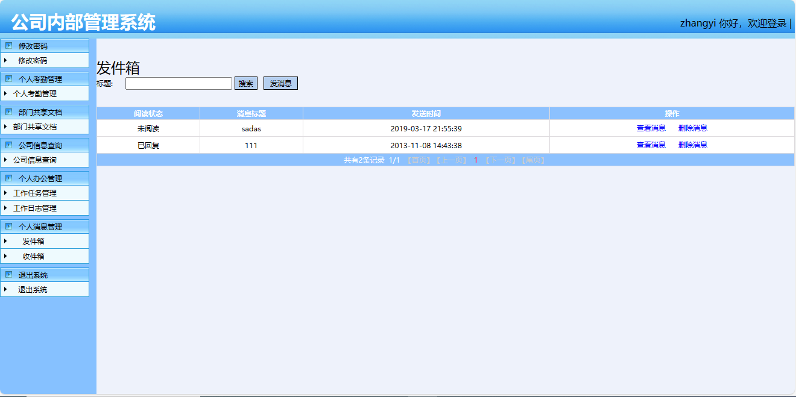
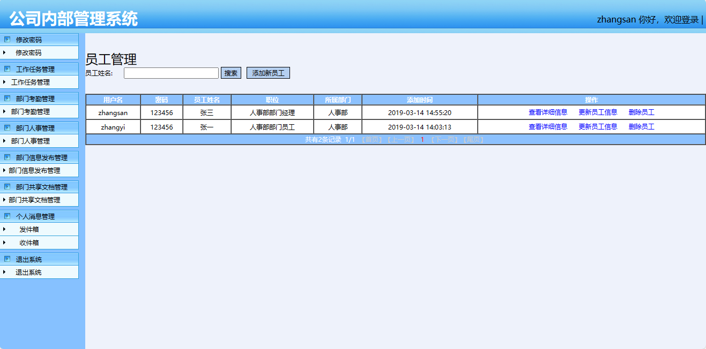

<h1 align="center">基于SSH的公司内部管理系统</h1>

- 完整代码获取地址：从戎源码网 ([https://armycodes.com/](https://armycodes.com/))
- 作者微信：19941326836  QQ：952045282 
- 承接计算机毕业设计、Java毕业设计、Python毕业设计、深度学习、机器学习
- 选题+开题报告+任务书+程序定制+安装调试+论文+答辩ppt 一条龙服务
- 所有选题地址（https://github.com/YuLin-Coder/AllProjectCatalog）

## 项目介绍

基于SSH的公司内部管理系统，前端 `Jsp`，后端 `Spring` `SpringMVC` `Hibernate`，系统角色分为总经理、部门经理、普通员工，经理和员工通过该系统完成考勤数据录入，员工之间可以文档共享，消息沟通等，主要功能如下：

### 总经理：

- 基本操作：登录、修改密码、退出
- 部门管理：查看部门、添加部门、更新部门、删除部门；字段包括名称、联系电话、简介
- 人事管理：添加新员工、查看详细信息、更新员工信息、删除员工、提升为部门经理
- 信息发布管理：发布信息、查看详细信息、更新信息、删除信息
- 共享文档：添加文档、下载文档、查看文档、删除文档
- 个人消息管理：发件箱、发消息、查看消息、删除消息，收件箱、搜索、查看消息、回复信息、删除消息

### 部门经理：

- 基本操作：登录、修改密码、退出
- 工作任务管理：搜索、添加工作任务、查看详细信息、工作评估、更新信息、删除
- 部门考勤管理：根据考勤类型和审核状态搜索、查看详细信息
- 部门人事管理：根据员工名称搜索、添加新员工、查看详细信息、更新员工信息、删除员工
- 部门信息发布管理：根据信息类型和标题搜索、发布信息、查看详细信息、更新信息、删除信息
- 部门文档共享：根据文档标题搜索、添加文档、下载文档、查看文档、删除文档
- 个人消息管理：发件箱、发消息、查看消息、删除消息，收件箱、搜索、查看消息、回复信息、删除消息

### 普通员工：

- 基本操作：登录、修改密码、退出
- 个人考勤管理：根据考勤类型和审核状态搜索记录、添加考勤、查看详细信息、更新信息、删除信息
- 部门文档共享：根据文档标题搜索、添加文档、下载文档、查看文档、删除文档
- 公司信息查询：根据信息类型查询，根据信息标题模糊查询、查看详细信息
- 个人办公管理：根据工作概述搜索记录、查看详细信息、工作汇报、添加工作日志、工作日志搜索、工作日志查看、工作日志更新、工作日志删除
- 个人消息管理：发件箱、发消息、查看消息、删除消息，收件箱、搜索、查看消息、回复信息、删除消息

## 环境

- <b>IntelliJ IDEA 2021.2</b>

- <b>Mysql 5.7.26</b>

- <b>Navicat  11.1.20.0</b>

- <b>Tomcat 7.0.73</b>

- <b>JDK 1.8</b>

## 缩略图

